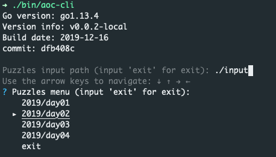

# advent-of-code
My solutions of puzzles for [Advent Of Code](https://adventofcode.com/)

This repository contains solutions for puzzles and cli tool to run solutions to get answers for input on site.

## Usage of aoc-cli

Download binary from 
and execute

Run it and follow instructions

### Demo

