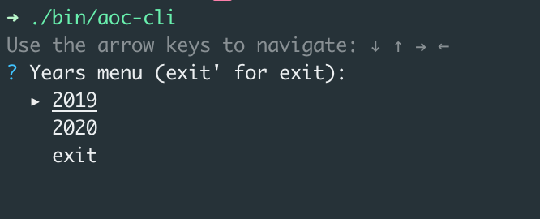
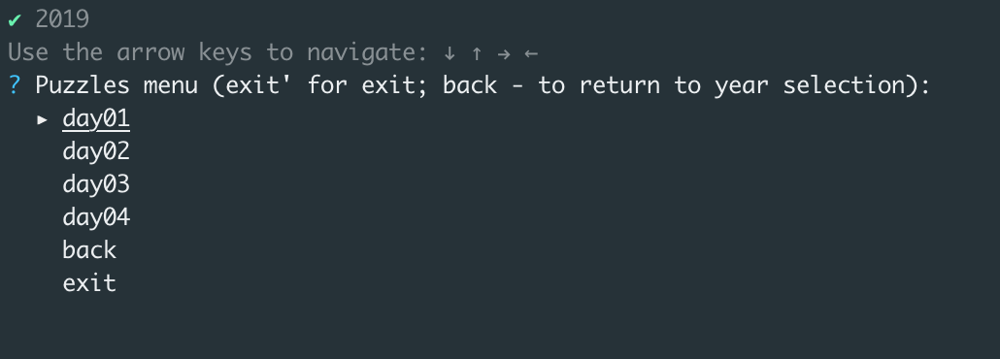

# advent-of-code

    

  

[**Advent of Code**](http://adventofcode.com/) is an Advent calendar of small programming puzzles for a 
variety of skill sets and skill levels that can be solved in any programming language you like. 
People use them as a [speed contest](https://adventofcode.com/2019/leaderboard), interview prep, company training, 
university coursework, practice problems, 
or to [challenge each other](https://www.reddit.com/r/adventofcode/search?q=flair%3Aupping&restrict_sr=on).

This repository contains solutions for puzzles and cli tool to run solutions to get answers for input on site.

## Implemented solutions

  
2015
  
    
  - [ ] Day 1: Not Quite Lisp
  - [ ] Day 2: I Was Told There Would Be No Math
  - [ ] Day 3: Perfectly Spherical Houses in a Vacuum
  - [ ] Day 4: The Ideal Stocking Stuffer
  - [ ] Day 5: Doesn't He Have Intern-Elves For This?
  - [ ] Day 6: Probably a Fire Hazard
  - [ ] Day 7: Some Assembly Required
  - [ ] Day 8: Matchsticks
  - [ ] Day 9: All in a Single Night
  - [ ] Day 10: Elves Look, Elves Say
  - [ ] Day 11: Corporate Policy
  - [ ] Day 12: JSAbacusFramework.io
  - [ ] Day 13: Knights of the Dinner Table
  - [ ] Day 14: Reindeer Olympics
  - [ ] Day 15: Science for Hungry People
  - [ ] Day 16: Aunt Sue
  - [ ] Day 17: No Such Thing as Too Much
  - [ ] Day 18: Like a GIF For Your Yard
  - [ ] Day 19: Medicine for Rudolph
  - [ ] Day 20: Infinite Elves and Infinite Houses
  - [ ] Day 21: RPG Simulator 20XX
  - [ ] Day 22: Wizard Simulator 20XX
  - [ ] Day 23: Opening the Turing Lock
  - [ ] Day 24: It Hangs in the Balance
  - [ ] Day 25: Let It Snow
    

  
2016
  
    
  - [ ] Day 1: No Time for a Taxicab
  - [ ] Day 2: Bathroom Security
  - [ ] Day 3: Squares With Three Sides
  - [ ] Day 4: Security Through Obscurity
  - [ ] Day 5: How About a Nice Game of Chess?
  - [ ] Day 6: Signals and Noise
  - [ ] Day 7: Internet Protocol Version 7
  - [ ] Day 8: Two-Factor Authentication
  - [ ] Day 9: Explosives in Cyberspace
  - [ ] Day 10: Balance Bots
  - [ ] Day 11: Radioisotope Thermoelectric Generators
  - [ ] Day 12: Leonardo's Monorail
  - [ ] Day 13: A Maze of Twisty Little Cubicles
  - [ ] Day 14: One-Time Pad
  - [ ] Day 15: Timing is Everything
  - [ ] Day 16: Dragon Checksum
  - [ ] Day 17: Two Steps Forward
  - [ ] Day 18: Like a Rogue
  - [ ] Day 19: An Elephant Named Joseph
  - [ ] Day 20: Firewall Rules
  - [ ] Day 21: Scrambled Letters and Hash
  - [ ] Day 22: Grid Computing
  - [ ] Day 23: Safe Cracking
  - [ ] Day 24: Air Duct Spelunking
  - [ ] Day 25: Clock Signal
    

  
2017
  
    
  - [ ] Day 1: Inverse Captcha
  - [ ] Day 2: Corruption Checksum
  - [ ] Day 3: Spiral Memory
  - [ ] Day 4: High-Entropy Passphrases
  - [ ] Day 5: A Maze of Twisty Trampolines, All Alike
  - [ ] Day 6: Memory Reallocation
  - [ ] Day 7: Recursive Circus
  - [ ] Day 8: I Heard You Like Registers
  - [ ] Day 9: Stream Processing
  - [ ] Day 10: Knot Hash
  - [ ] Day 11: Hex Ed
  - [ ] Day 12: Digital Plumber
  - [ ] Day 13: Packet Scanners
  - [ ] Day 14: Disk Defragmentation
  - [ ] Day 15: Dueling Generators
  - [ ] Day 16: Permutation Promenade
  - [ ] Day 17: Spinlock
  - [ ] Day 18: Duet
  - [ ] Day 19: A Series of Tubes
  - [ ] Day 20: Particle Swarm
  - [ ] Day 21: Fractal Art
  - [ ] Day 22: Sporifica Virus
  - [ ] Day 23: Coprocessor Conflagration
  - [ ] Day 24: Electromagnetic Moat
  - [ ] Day 25: The Halting Problem
    

  
2018
  
    
  - [ ] [Day 1: Chronal Calibration](https://adventofcode.com/2018/day/1)
  - [ ] [Day 2: Inventory Management System](https://adventofcode.com/2018/day/2)
  - [ ] [Day 3: No Matter How You Slice It](https://adventofcode.com/2018/day/3)
  - [ ] [Day 4: Repose Record](https://adventofcode.com/2018/day/4)
  - [ ] [Day 5: Alchemical Reduction](https://adventofcode.com/2018/day/5)
  - [ ] [Day 6: Chronal Coordinates](https://adventofcode.com/2018/day/6)
  - [ ] [Day 7: The Sum of Its Parts](https://adventofcode.com/2018/day/7)
  - [ ] [Day 8: Memory Maneuver](https://adventofcode.com/2018/day/8)
  - [ ] [Day 9: Marble Mania](https://adventofcode.com/2018/day/9)
  - [ ] [Day 10: The Stars Align](https://adventofcode.com/2018/day/10)
  - [ ] [Day 11: Chronal Charge](https://adventofcode.com/2018/day/11)
  - [ ] [Day 12: Subterranean Sustainability](https://adventofcode.com/2018/day/12)
  - [ ] [Day 13: Mine Cart Madness](https://adventofcode.com/2018/day/13)
  - [ ] [Day 14: Chocolate Charts](https://adventofcode.com/2018/day/14)
  - [ ] [Day 15: Beverage Bandits](https://adventofcode.com/2018/day/15)
  - [ ] [Day 16: Chronal Classification](https://adventofcode.com/2018/day/16)
  - [ ] [Day 17: Reservoir Research](https://adventofcode.com/2018/day/17)
  - [ ] [Day 18: Settlers of The North Pole](https://adventofcode.com/2018/day/18)
  - [ ] [Day 19: Go With The Flow](https://adventofcode.com/2018/day/19)
  - [ ] [Day 20: A Regular Map](https://adventofcode.com/2018/day/20)
  - [ ] [Day 21: Chronal Conversion](https://adventofcode.com/2018/day/21)
  - [ ] [Day 22: Mode Maze](https://adventofcode.com/2018/day/22)
  - [ ] [Day 23: Experimental Emergency Teleportation](https://adventofcode.com/2018/day/23)
  - [ ] [Day 24: Immune System Simulator 20XX](https://adventofcode.com/2018/day/24)
  - [ ] [Day 25: Four-Dimensional Adventure](https://adventofcode.com/2018/day/25)
  

  
2019
  
    
  - [x] [Day 1: The Tyranny of the Rocket Equation](https://adventofcode.com/2019/day/1)
  - [x] [Day 2: 1202 Program Alarm](https://adventofcode.com/2019/day/2)
  - [x] [Day 3: Crossed Wires](https://adventofcode.com/2019/day/3)
  - [x] [Day 4: Secure Container](https://adventofcode.com/2019/day/4)
  - [ ] [Day 5: Sunny with a Chance of Asteroids](https://adventofcode.com/2019/day/5)
  - [ ] [Day 6: Universal Orbit Map](https://adventofcode.com/2019/day/6)
  - [ ] [Day 7: Amplification Circuit](https://adventofcode.com/2019/day/7)
  - [ ] [Day 8: Space Image Format](https://adventofcode.com/2019/day/8)
  - [ ] [Day 9: Sensor Boost](https://adventofcode.com/2019/day/9)
  - [ ] [Day 10: Monitoring Station](https://adventofcode.com/2019/day/10)
  - [ ] [Day 11: Space Police](https://adventofcode.com/2019/day/11)
  - [ ] [Day 12: The N-Body Problem](https://adventofcode.com/2019/day/12)
  - [ ] [Day 13: Care Package](https://adventofcode.com/2019/day/13)
  - [ ] [Day 14: Space Stoichiometry](https://adventofcode.com/2019/day/14)
  - [ ] [Day 15: Oxygen System](https://adventofcode.com/2019/day/15)
  - [ ] [Day 16: Flawed Frequency Transmission](https://adventofcode.com/2019/day/16)
  - [ ] [Day 17: Set and Forget](https://adventofcode.com/2019/day/17)
  - [ ] [Day 18: Many-Worlds Interpretation](https://adventofcode.com/2019/day/18)
  - [ ] [Day 19: Tractor Beam](https://adventofcode.com/2019/day/19)
  - [ ] [Day 20: Donut Maze](https://adventofcode.com/2019/day/20)
  - [ ] [Day 21: Springdroid Adventure](https://adventofcode.com/2019/day/21)
  - [ ] [Day 22: Slam Shuffle](https://adventofcode.com/2019/day/22)
  - [ ] [Day 23: Category Six](https://adventofcode.com/2019/day/23)
  - [ ] [Day 24: Planet of Discord](https://adventofcode.com/2019/day/24)
  - [ ] [Day 25: Cryostasis](https://adventofcode.com/2019/day/25)
    

  
2020
  
    
  - [x] [Day 1: Report Repair](https://adventofcode.com/2020/day/1)
  - [x] [Day 2: Password Philosophy](https://adventofcode.com/2020/day/2)
  - [ ] [Day 3: Toboggan Trajectory](https://adventofcode.com/2020/day/3)
  - [ ] [Day 4: Passport Processing](https://adventofcode.com/2020/day/4)
  - [ ] [Day 5: Binary Boarding](https://adventofcode.com/2020/day/5)
  - [ ] [Day 6: Custom Customs](https://adventofcode.com/2020/day/6)
  - [ ] [Day 7: Handy Haversacks](https://adventofcode.com/2020/day/7)
  - [ ] [Day 8: Handheld Halting](https://adventofcode.com/2020/day/8)
  - [ ] [Day 9: Encoding Error](https://adventofcode.com/2020/day/9)
  - [ ] [Day 10: Adapter Array](https://adventofcode.com/2020/day/10)
  - [ ] [Day 11: Seating System](https://adventofcode.com/2020/day/11)
  - [ ] [Day 12: Rain Risk](https://adventofcode.com/2020/day/12)
  - [ ] [Day 13: Shuttle Search](https://adventofcode.com/2020/day/13)
  - [ ] [Day 14: Docking Data](https://adventofcode.com/2020/day/14)
  - [ ] [Day 15: Rambunctious Recitation](https://adventofcode.com/2020/day/15)
  - [ ] [Day 16: Ticket Translation](https://adventofcode.com/2020/day/16)
  - [ ] [Day 17: Conway Cubes](https://adventofcode.com/2020/day/17)
  - [ ] [Day 18: Operation Order](https://adventofcode.com/2020/day/18)
  - [ ] [Day 19: Monster Messages](https://adventofcode.com/2020/day/19)
  - [ ] [Day 20: Jurassic Jigsaw](https://adventofcode.com/2020/day/20)
  - [ ] [Day 21: Allergen Assessment](https://adventofcode.com/2020/day/21)
  - [ ] [Day 22: Crab Combat](https://adventofcode.com/2020/day/22)
  - [ ] [Day 23: Crab Cups](https://adventofcode.com/2020/day/23)
  - [ ] [Day 24: Lobby Layout](https://adventofcode.com/2020/day/24)
  - [ ] [Day 25: Combo Breaker](https://adventofcode.com/2020/day/25)
    

## Usage of aoc-cli

Download binary from 
and execute

Run it and follow instructions

### Demo

